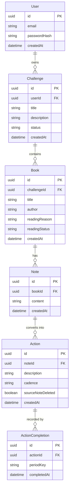

# Phase 1 Data Model: Reading-to-Action System

Derived from the spec's Key Entities and Functional Requirements. The model encodes the
core chain **Challenge -> Book -> Note -> Action -> Results** with per-user scoping and
referential integrity (FR-008, FR-011, FR-012, FR-013).

## Entity Relationship Overview

## Entities

### User
Represents an account owner. All other data is scoped to a user.

| Field | Type | Notes |
|-------|------|-------|
| id | UUID | Primary key |
| email | string | Unique, required |
| passwordHash | string | Required (session-based auth) |
| createdAt | datetime | Defaults to now |

### Challenge
A personal problem or goal the user wants to solve (FR-001).

| Field | Type | Notes |
|-------|------|-------|
| id | UUID | Primary key |
| userId | UUID | FK -> User; required; scopes all access |
| title | string | Required, 1-200 chars |
| description | string | Optional |
| status | enum | `active` \| `archived`; default `active` |
| createdAt | datetime | Defaults to now |

- Relationships: owns zero or more Books.
- Validation: title non-empty (FR-001).
- Delete: deleting a Challenge with Books requires explicit confirmation; cascades to
  Books -> Notes -> Actions -> ActionCompletions (FR-012).

### Book
A book chosen to address a challenge (FR-002, FR-003).

| Field | Type | Notes |
|-------|------|-------|
| id | UUID | Primary key |
| challengeId | UUID | FK -> Challenge; required |
| title | string | Required, 1-300 chars |
| author | string | Required, 1-200 chars |
| readingReason | string | Optional ("why I decided to read this", FR-003) |
| readingStatus | enum | `to_read` \| `reading` \| `done`; default `to_read` |
| createdAt | datetime | Defaults to now |

- Relationships: belongs to one Challenge; owns zero or more Notes.
- Validation: title and author non-empty; reason may be empty (edge case).
- Delete: with Notes requires confirmation; cascades to Notes -> Actions.

### Note
An insight captured while reading (FR-004).

| Field | Type | Notes |
|-------|------|-------|
| id | UUID | Primary key |
| bookId | UUID | FK -> Book; required |
| content | string | Required, free-form text |
| createdAt | datetime | Defaults to now |

- Relationships: belongs to one Book; can be the source of zero or more Actions.
- Delete: Actions derived from it are NOT deleted; their `sourceNoteDeleted` is set true
  and `noteId` link is cleared/retained per edge case (FR-005 traceability vs. edge case).

### Action
An actionable task derived from a note (FR-005, FR-006, FR-007, FR-010).

| Field | Type | Notes |
|-------|------|-------|
| id | UUID | Primary key |
| noteId | UUID (nullable) | FK -> Note; set null when source note deleted |
| description | string | Required |
| cadence | enum | `daily` \| `weekly` \| `monthly` \| `one_time`; required (FR-006) |
| sourceNoteDeleted | boolean | Default false; true if originating note removed |
| createdAt | datetime | Defaults to now |

- Relationships: references one Note (its source); recorded by zero or more
  ActionCompletions.
- Validation: cadence is required and must be one of the four values (FR-006).
- Traceability: via Note -> Book -> Challenge (FR-008).

### ActionCompletion
A record that an action was completed for a given period (FR-007, FR-009, FR-010).

| Field | Type | Notes |
|-------|------|-------|
| id | UUID | Primary key |
| actionId | UUID | FK -> Action; required |
| periodKey | string | Period identifier (see below) |
| completedAt | datetime | Defaults to now |

- `periodKey` format by cadence:
  - `daily`: `YYYY-MM-DD`
  - `weekly`: `YYYY-Www` (ISO week, e.g. `2026-W22`)
  - `monthly`: `YYYY-MM`
  - `one_time`: constant `once`
- Uniqueness: `(actionId, periodKey)` is unique — an action can be completed at most once
  per period. Reopening (FR-007) deletes the completion record for the current period.

## Derived: Progress / Results

Not stored. Computed per Challenge (and rolled up from its Books/Notes/Actions) for the
progress review (FR-009):

- **Actions created**: count of Actions traceable to the challenge.
- **Actions completed (current period)**: count of Actions with an ActionCompletion whose
  `periodKey` matches the current period for the action's cadence.
- **One-time completion**: an action is "completed" if any ActionCompletion exists.

## State Transitions

- **Book.readingStatus**: `to_read` -> `reading` -> `done` (user-driven; any forward or
  backward transition allowed).
- **Challenge.status**: `active` <-> `archived`.
- **Action completion (per period)**: open -> completed (create ActionCompletion) ->
  open (delete ActionCompletion for that period). Recurring actions reopen automatically
  for each new period because no completion record exists yet for the new `periodKey`.

## Integrity & Scoping Rules

- Every read/write is filtered by the authenticated `userId` through the Challenge chain
  (FR-013).
- Foreign keys enforce the chain; cascade deletes apply except Note->Action, which
  detaches rather than deletes (edge case).
- All writes are transactional so partial failures do not leave orphaned records (FR-011).
